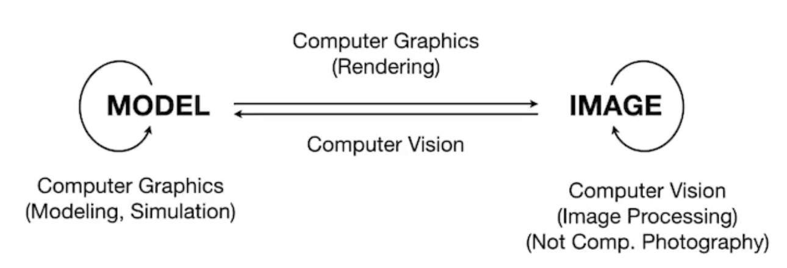

- [[Games101]] [[Games101P1]]
	- 课程
		- 光栅化
		- 几何
		- 光线追踪(Ray Tracing)
		- Animation / Simulation
			- 动画系统和布料模拟
	- 实时与离线
		- 实时要求在规定时间内生成规定数量的画面，称为帧/每秒(fps)
		- 如果达不到实时要求，则称为离线
	- 计算机图形学与计算机视觉有什么不同？
		- 计算机视觉着重于 **预测**
		- 计算机图形学着重于 **看**
		- {:height 207, :width 455}
- [[Games101]] [[Games101P2]]
	- 图形学的依赖
		- 基础数学
			- 线性代数
				- 向量
				- 矩阵
			- 微积分
		- 基础的物理
			- 光学
			- 物理
		- 杂项
			- 信号处理
				- 走样/反走样
			- 数值分析
				- 解决复杂的数学计算
		- 美感
	- 向量
		-